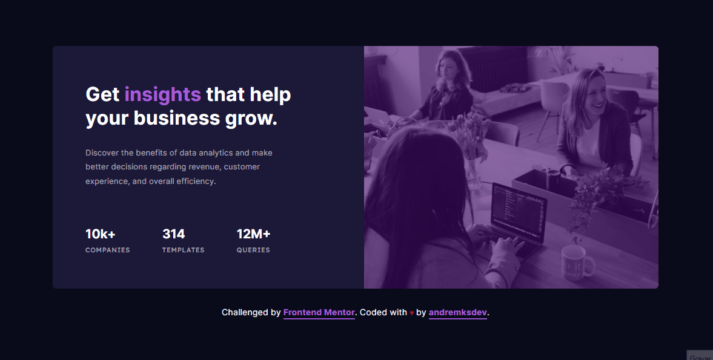
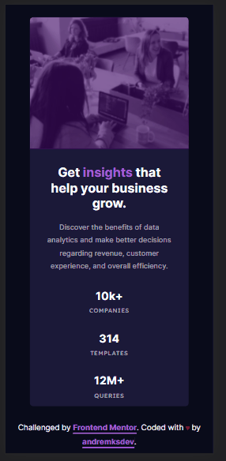
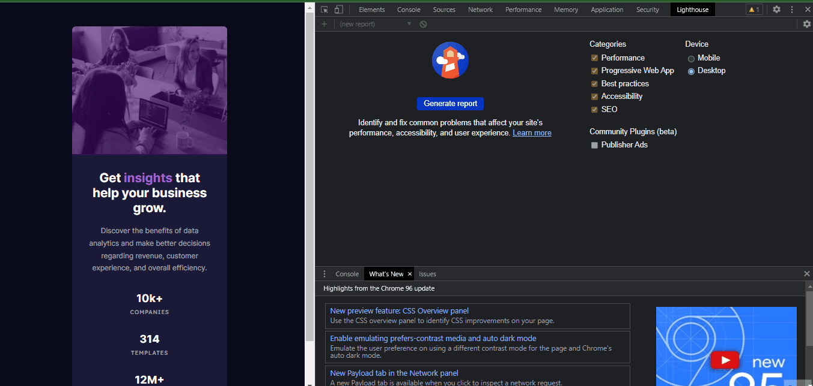

 

<h1 align="center">Welcome 👋 - Challenge 002 • Stats preview card component </h1>

 <a href="#about">About</a> •
 <a href="#layout">Layout</a> •
 <a href="#deploy">Deploy</a> •
 <a href="#challenges">Challenges</a> •
 <a href="#technologies">Technologies</a> •
 <a href="#autor">Autor</a>

 
<h3 align="center"><strong>Desktop model</strong></h3>

  
  <h3 align="center"><strong>Mobile model</strong></h3>

  

 

<h3 id="about"><strong>📝 About</strong></h3>

The challenge is to build this card component and make it look as close as possible to the design proposed by the <a href="https://www.frontendmentor.io/challenges/stats-preview-card-component-8JqbgoU62"><strong>frontendmentor</strong></a> . (See layout)

To accomplish this challenge, you could use whatever tools you want to help complete it.

In the end users must be able to:

- View optimal layout depending on device screen size

 

<h3 id="layout"><strong>📐 Layout</strong></h3>

Project layout provided by the frontend through PNG image. All the grid detail was developed by me using metric tools in <a href="https://www.figma.com"><strong>FIGMA</strong></a> itself, as I don't have access to the original material.

obs: To have access to the original layout in FIGMA, the front alteror has a paid subscription.
 
 
 

<h3 align="center"><strong>Desktop model</strong></h3>

  

  <h3 align="center"><strong>Mobile model</strong></h3>

  

<h3 id="deploy"><strong>🌐 Deploy</strong></h3>

[Github Pages](https://andremksdev.github.io/challenge-stats-preview-card-component-002/)

 

<h3 id="deploy"><strong>🔍 Audit metrics - Lighthouse</strong></h3>

<h3><strong>Audit web apps with Lighthouse</strong></h3>

Lighthouse is an open-source automated tool that improves the quality of web apps. It can run as a Chrome extension or from the command line. Tell Lighthouse a URL you want to audit. It will run a series of tests on the page and report on the page's performance. In this report, you can use the tests that failed as indicators of what can be done to improve the application.

Note: Right now, Lighthouse focuses primarily on Progressive Web Apps features such as Add to Home screen and offline mode support. However, the overall goal of the project is to provide a comprehensive audit of all aspects of a web app's quality. 

 

  

 

<h3 id="challenges"><strong>🎯 Challenges</strong></h3>

- [x] Desktop version
- [x] Mobile version
- [x] Flexbox
- [x] Responsive
- [x] Use of ::before

 

<h3 id="technologies"><strong>⚙️ Technologies</strong></h3>

The technologies used for this project were:

- [HTML](https://developer.mozilla.org/en-US/docs/Web/HTML)
- [CSS](https://developer.mozilla.org/en-US/docs/Web/CSS)

 

<h3 id="autor"><strong>👨‍💻 Autor</strong></h3>

Made by andremksdev 👋

